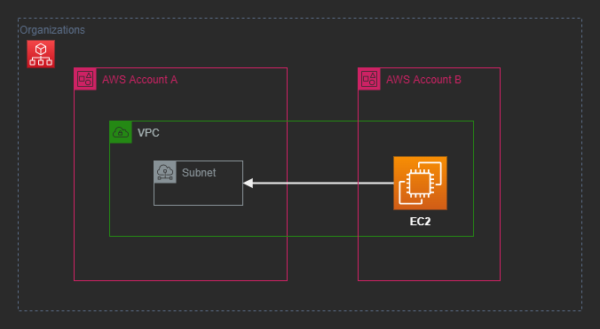
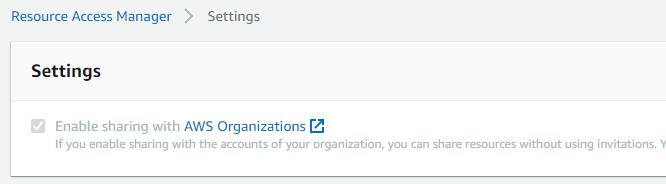
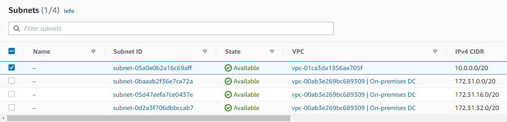

# AWS RAM

Sharing across accounts or member accounts within an Organization.



## Procedure

If you're in an Organization, make sure that Enable Sharing is ticked:



Create a share, informing the parameters for which you want to grant access and the `$arn` of the resource:

```sh
aws ram create-resource-share \
  --name 'MyNewResourceShare' \
  --principals '<principal_id>' \
  --resource-arns '<arn1>' '<arn2>' '<arn3>' \
  --no-allow-external-principals
```

Resources can be shared with multiple accounts, and event to an entire Organization. You could also re it with the option 

To list for example subnet ARNs: `aws ec2 describe-subnets`

Once shared, you should now be able to switch accounts to see the subnet:



To finish, remove the resource share:

---

### Clean-up

```sh
aws ram delete-resource-share --resource-share-arn '<arn>'
```
